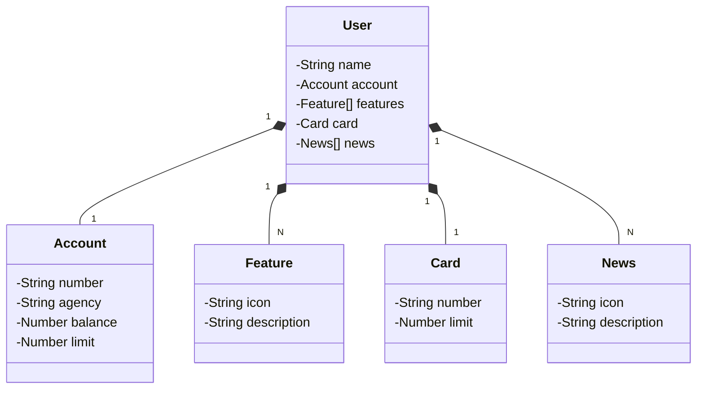

# Santander Dev Week 2024

Repositório para compartilhar o projeto Java RESTful API realizado durante o Bootcamp Santander Java Developer 2024.

## Este projeto foi realizado durante o Bootcamp Santander Java Developer - 2024, com a intenção de publicar uma API RESTful na Nuvem usando Spring Boot 3, Java 17 e Railway.

### Passos a serem realizados:

-   Criação e Versionamento da API
    -   Spring Initializr e GitHub
-   Abstração e Modelagem do Domínio
    -   Figma, ChatGPT (Mermaid) e JPA
-   Implementação do Backend
    -   Spring Boot e Java 17
-   Deploy e Monitoramento
    -   Railway (PostgreSQL e CI/CD da API)

## [Link do Figma](https://www.figma.com/file/0ZsjwjsYlYd3timxqMWlbj/SANTANDER---Projeto-Web%2FMobile?type=design&node-id=1421-432&mode=design)

-   O Figma foi utilizado para a abstração do domínio desta API, sendo útil na análise e projeto da solução.

## Diagrama de Classes (Domínio da API)

## Principais Tecnologias

-   Java 17: Utilizaremos a versão LTS mais recente do Java para tirar vantagem das últimas inovações que essa linguagem robusta e amplamente utilizada oferece;
-   Spring Boot 3: Trabalharemos com a mais nova versão do Spring Boot, que maximiza a produtividade do desenvolvedor por meio de sua poderosa premissa de autoconfiguração;
-   Spring Data JPA: Exploraremos como essa ferramenta pode simplificar nossa camada de acesso aos dados, facilitando a integração com bancos de dados SQL;
-   OpenAPI (Swagger): Vamos criar uma documentação de API eficaz e fácil de entender usando a OpenAPI (Swagger), perfeitamente alinhada com a alta produtividade que o Spring Boot oferece;
-   Railway: facilita o deploy e monitoramento de nossas soluções na nuvem, além de oferecer diversos bancos de dados como serviço e pipelines de CI/CD.
